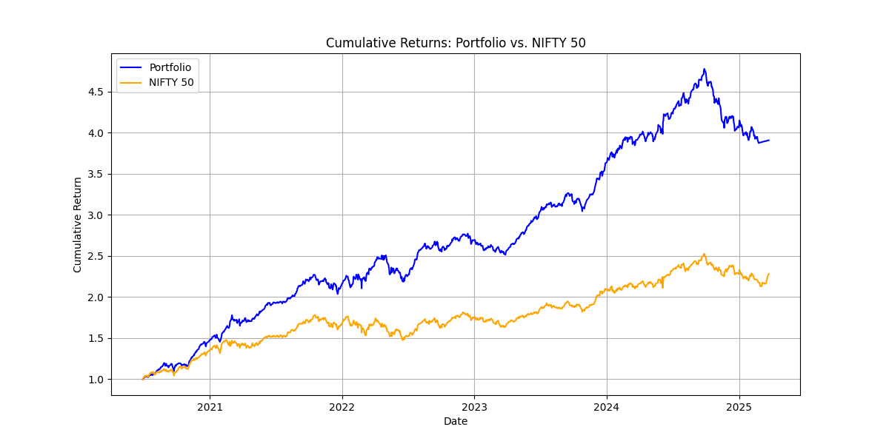
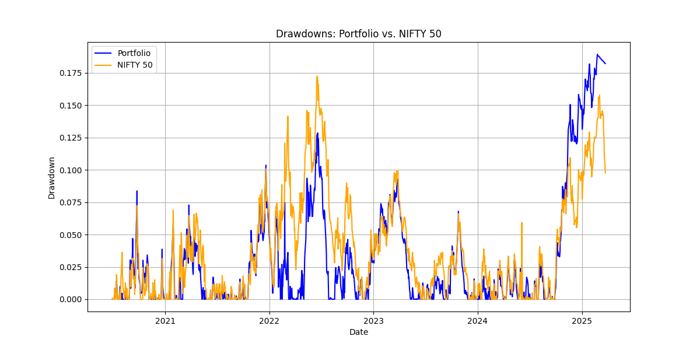

# black-litterman-lstm-nifty50
LSTM-enhanced Black-Litterman model using NIFTY 50 stocks
# Black-Litterman Portfolio Optimization Enhanced with LSTM Forecasts on NIFTY 50

## Overview
This project integrates the Black-Litterman (BL) model with LSTM-based return forecasts to construct optimized portfolios from the NIFTY 50 stocks. The goal is to enhance traditional portfolio optimization by incorporating posterior views on asset performance.

> **Period**: March 26, 2020 – March 25, 2025   
> **Universe**: NIFTY 50 Index (50 Indian equities)   
> **Benchmark**: NIFTY 50 Index   
> **Backtesting Frequency**: Monthly rebalancing 

---

## Methodology

- **Data**: Historical prices from Yahoo Finance
- **LSTM Forecasting**:
  - 2 LSTM layers (100 units), dropout 0.2
  - Output: daily return forecast for each stock
- **Annualized Expected Returns**: 252 × forecasted daily return
- **Confidence Level**: Inverse volatility scaled across assets
- **Black-Litterman**:
  - Prior = market-implied returns (λ = 2.5)
  - Views = LSTM forecasts (τ = 0.25)
  - Ω = diagonal matrix from confidence levels

---

## Results

- **Annualized Return**: 24.57% 
- **Sharpe Ratio**: 1.69 
- **Volatility**: 10.98% 
- **Max Drawdown**: -21.07% 
- **Benchmark Sharpe**: 0.87

  
  

---

